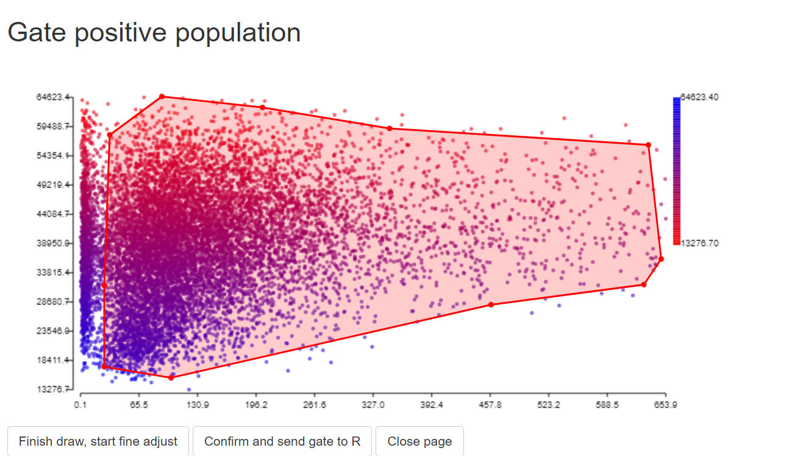
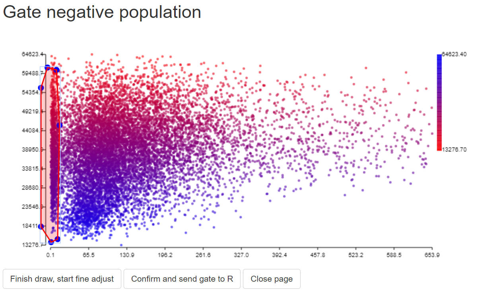
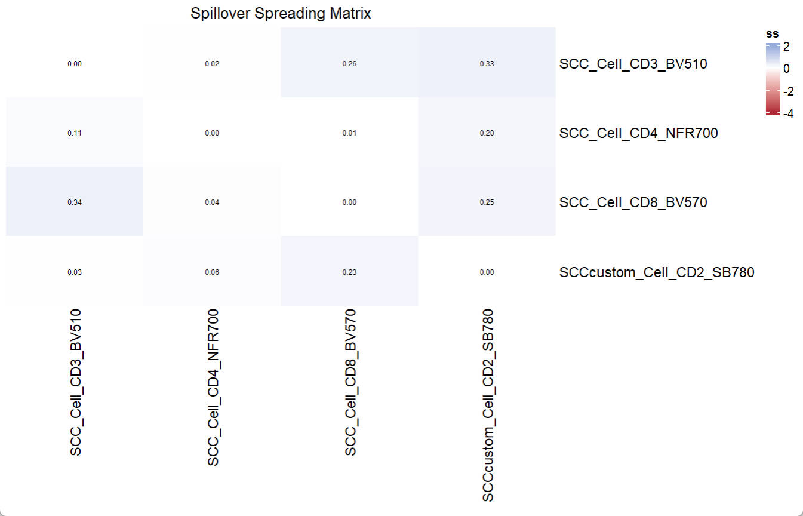

# instruction for USERM use with Custom SCCs

Xiangming Cai

2026-01-28

## 🔍 Introduction
The USERM supports predicting spread for unmixed spectral flow cytometry data, which helps for panel design and interpratation of unmixed results. There are over 200 built-in Single-color controls (SCCs) provided by the USERM. However, users can also apply USERM on their own SCCs. This helps when users need specific fluorescence not provided by USERM, or when they are using instruments not included in the USERM.

In this instruction, we will show how to apply USERM on custom SCCs. We need to first extract signatures from SCCs and prepare res objects for each SCC. Then, we can easily predict with these custom SCCs (or together with built-in SCCs). For Spillover Spreading Matrix (SSM) calculation, we also need to prepare ssm objects.

## Step 0 📈 load packages and set custom_dir

``` r
# devtools::install_github("xiangmingcai/USERM")
library(USERM)
library(flowCore)
# devtools::install_github("xiangmingcai/GateData")
library(GateData)
library(dplyr)
library(ggplot2)
library(MASS)
library(circlize)
library(ComplexHeatmap)

custom_dir = "E:/MyFolder"
dir.create(paste0(custom_dir,"/sig"))
dir.create(paste0(custom_dir,"/res"))
dir.create(paste0(custom_dir,"/ssm"))
```
The custom_dir will store generated files, which is required for prediction. Please change the custom_dir to your local output folder.

## Step 1 📈 Prepare signature
We need to prepare signatures for each SCC seperately. The steps for Autofluroescence (AF) extraction are almost the same, unless specified.

Normally, unstained sample is needed for AF extraction. However, you can extract AF from negative population in SCC if you do not have unstained sample.

### step 1.1 read in scc fcs


``` r
data_path = system.file("example_data", "SCC_Cell_CD2_SB780.fcs", package = "USERM")
print(data_path)
data = read.FCS(data_path) #set the path to your SCC .fcs file
# data = read.FCS(system.file("example_data", "unstained.fcs", package = "USERM")) #this is for AF

print(head(data@parameters@data$desc))
print(head(data@parameters@data$name))
desc = data@parameters@data$desc # "desc" or "name" are used for different insruments. Ues the one with correct detector names.

data = exprs(data)
data = as.data.frame(data)
colnames(data) = desc
head(data)
```

``` r
> print(head(data@parameters@data$desc))
       $P1S        $P2S        $P3S        $P4S        $P5S        $P6S 
     "Time"  "Run Time"  "Event ID" "488 FSC-H" "488 FSC-A" "488 FSC-W" 
> print(head(data@parameters@data$name))
      $P1N       $P2N       $P3N       $P4N       $P5N       $P6N 
    "Time" "Run Time" "Event ID"  "FSC51-H"  "FSC51-A"  "FSC51-W" 

> head(data)
  Time Run Time Event ID 488 FSC-H 488 FSC-A 488 FSC-W  488 FSC 488 SSC-H 488 SSC-A 488 SSC-W  488 SSC 488 FSC Polar-H
1  966      966        1  11053.84  11367.57  13671.88 11367.57  26975.94  27930.18  13671.88 27930.18        12814.00
2  991      991        2  46370.00  53884.65  15234.38 53884.65  92353.13  99999.98  16210.94 99999.98        54518.63
3 1066     1066        3  53632.18  60693.39  15039.06 60693.39  38315.37  43835.29  15039.06 43835.29        62066.83
4 1135     1135        4  56737.39  64002.36  15039.06 64002.36  37044.19  43117.40  15429.69 43117.40        66313.27
5 1233     1233        5  31609.00  36513.11  15429.69 36513.11  40273.66  46527.43  15039.06 46527.43        37028.07
6 1274     1274        6  21817.04  26400.30  16015.62 26400.30  55891.99  66402.58  15625.00 66402.58        24883.68
...
  405 FSC-A 405 FSC-W  405 FSC 405 SSC-H 405 SSC-A 405 SSC-W   405 SSC 349nm - 387/11-A 349nm - 387/11 349nm - 420/10-A
1  17551.05  13085.94 17551.05  9475.255  9475.971  13476.56  9475.971         2.872925       2.872925        6.1988525
2  57257.59  13671.88 57257.59 45441.043 53445.719  15234.38 53445.719         4.613342       4.613342        2.5987549
3  37115.38  13085.94 37115.38 14217.615 15710.759  14648.44 15710.759         2.360291       2.360291        8.5353394
4  46662.83  12500.00 46662.83 16527.271 18565.000  14843.75 18565.000         6.043884       6.043884        0.7271729
5  47614.96  11914.06 47614.96 15896.583 17418.504  14257.81 17418.504         1.561584       1.561584        1.0132446
6  46072.35  13476.56 46072.35 22898.090 27236.199  15625.00 27236.199         2.038452       2.038452        0.8344116
...

```
The detector ids are stored in the data@parameters@data. However, it can be on the desc slot or the name slot, depends on the flow instrument. You need to check it for your own FCS. Here we use desc slot.

### step 1.2 set scc fcs info

``` r
peak_channel = '405nm - 770/LP-A' #
save_suf = "SCCcustom_Cell_CD2_SB780"
PrimaryName = "CD2"
SecondaryName = "SB780"

# save_suf = "SCCcustom_Cell_AF_AF" #For AF.
# PrimaryName = "AF" #For AF.
# SecondaryName = "AF" #For AF.
```
You may use public resource (e.g. fluorofinder) to find the peak channel of your SCC.

The save_suf is important name of the SCC, which should be unique. it is recommended to follow the naming pattern shown here. There are 4 elements in the name, which are separated by underscore.

**The first element is "batch" element.** The built-in SCCs use "SCC1", "SCC2", and so on to annotate SCC files acquired in distinct batches.You can use "SCCcustom" to distinguish custom SCCs and built-in SCCs. You can also use others that make sense to you.

**The second element is "type" element.** Now We only have "Cell" and "Bead". You can set it as others like "PBMC" if that make sense to you.

**The third element is "PrimaryName".** Normally we put target of the antibody here，e.g. CD2.

**The last element is "SecondaryName",** Normally we put fluroescence of the antibody here, e.g. SB780.

Please avoid using space or underscore within these elements.


### step 1.3 gate positive popualtion and negative population

In this step, we need to find positive and negative populations. You can use the GateData R package or other packages that works for you. Here we show how to gate a subset population with the GateData

For detailed instruction of GateData, please refer to [GateData](https://github.com/xiangmingcai/GateData)

Brief instruction: draw a gate, and click 3 buttons in order.

``` r
# 1. sample cells.
#You may modify code here to sample specific set for rare markers.
data$gate0 = TRUE
data = sample_n(data, 20000)

# 2. gate singlets if need
# You can change the FSC and SSC names for specific instrument.
# use colnames(data) to find available paramters
# colnames(data)
gate1<-PolygonGating(df=data, x_col= "488 FSC-A", y_col= "488 FSC-H", feature_col= "488 FSC-A",
                     parentgate_col= "gate0", newgate_col= "gate1",canvas_width=800, canvas_height=400,
                     title_text = "Gate singlets")
data <-GateDecider(gate = gate1, df = data)
gate2<-PolygonGating(df=data, x_col= "488 SSC-A", y_col= "488 SSC-H", feature_col= "488 SSC-A",
                     parentgate_col= "gate1", newgate_col= "gate2",canvas_width=800, canvas_height=400,
                     title_text = "Gate singlets")
data <-GateDecider(gate = gate2, df = data)
```
<p align="center">


</p>

<p align="center">


</p>


``` r
# 3. gate target population (e.g. lymphocytes)
gate3<-PolygonGating(df=data, x_col= "488 SSC-A", y_col= "488 FSC-A", feature_col= "488 SSC-A",
                     parentgate_col= "gate2", newgate_col= "gate3",canvas_width=800, canvas_height=500,
                     title_text = "Gate target population")
data <-GateDecider(gate = gate3, df = data)
```
<p align="center">


</p>

``` r
# 4. gate positive and negative populations.
#For autofluorescence, randomly gate a negative populaiton and assign zero to it.

data = data[data$gate3,]
gate_pos<-PolygonGating(df=data, x_col= peak_channel, y_col= "488 SSC-A", feature_col= "488 SSC-A",
                        parentgate_col= "gate3", newgate_col= "gate_pos",canvas_width=800, canvas_height=400,
                        title_text = "Gate positive population")
data <-GateDecider(gate = gate_pos, df = data)
gate_neg<-PolygonGating(df=data, x_col= peak_channel, y_col= "488 SSC-A", feature_col= "488 SSC-A",
                        parentgate_col= "gate3", newgate_col= "gate_neg",canvas_width=800, canvas_height=400,
                        title_text = "Gate negative population")
data <-GateDecider(gate = gate_neg, df = data)

table(data$gate_pos)
table(data$gate_neg)
data_pos = data[data$gate_pos,]
data_neg = data[data$gate_neg,]


# data_neg[,] <- 0 # For autofluorescence, assign zero to data_neg

# #you may save the gates if needed.
# saveRDS(list(gate1,gate2,gate3,gate_pos,gate_neg), file = paste0(custom_dir,"/",save_suf,"_gatelist.rds"))
# saveRDS(c("gate1","gate2","gate3","gate_pos","gate_neg"), file = paste0(custom_dir,"/",save_suf,"_gatenames.rds"))

``` 

``` r
> table(data$gate_pos)

FALSE  TRUE 
11669   361 
> table(data$gate_neg)

FALSE  TRUE 
 6202  5828 
``` 
<p align="center">


</p>

<p align="center">


</p>


### step 1.4 extract signatures

``` r
#Select detectors. Please select only the detectors for unmixing
colnames(data)
cols = colnames(data)[seq(from=28, to=128, by=2)]
print(cols)

Sig = ExtractSig(df_pos = data_pos,df_neg = data_neg,
                 cols = cols, method = "median",
                 PrimaryName = PrimaryName,
                 SecondaryName = SecondaryName,
                 id = save_suf,
                 instrument = "Xenith",
                 Source = "YourName",
                 Note = NA)

#you may briefly check the signature
df <- data.frame(Detector = names(Sig$Signature),Signal = as.numeric(Sig$Signature))
ggplot(df, aes(x = Detector, y = Signal, group = 1)) +
  geom_line(color = "steelblue", linewidth = 1) +
  geom_point(color = "darkred", size = 2) +
  theme_minimal() +
  theme(axis.text.x = element_text(angle = 90, hjust = 1)) +
  labs(title = save_suf,
       x = "Detector",
       y = "Signal")
``` 
``` r
> colnames(data)
  [1] "Time"             "Run Time"         "Event ID"         "488 FSC-H"        "488 FSC-A"        "488 FSC-W"       
  [7] "488 FSC"          "488 SSC-H"        "488 SSC-A"        "488 SSC-W"        "488 SSC"          "488 FSC Polar-H" 
 [13] "488 FSC Polar-A"  "488 FSC Polar-W"  "488 FSC Polar"    "488 SSC Polar-H"  "488 SSC Polar-A"  "488 SSC Polar-W" 
 [19] "488 SSC Polar"    "405 FSC-H"        "405 FSC-A"        "405 FSC-W"        "405 FSC"          "405 SSC-H"       
 [25] "405 SSC-A"        "405 SSC-W"        "405 SSC"          "349nm - 387/11-A" "349nm - 387/11"   "349nm - 420/10-A"
 [31] "349nm - 420/10"   "349nm - 434/17-A" "349nm - 434/17"   "349nm - 455/14-A" "349nm - 455/14"   "349nm - 473/15-A"
 [37] "349nm - 473/15"   "349nm - 507/19-A" "349nm - 507/19"   "349nm - 549/15-A" "349nm - 549/15"   "349nm - 575/15-A"
 [43] "349nm - 575/15"   "349nm - 615/24-A" "349nm - 615/24"   "349nm - 670/30-A" "349nm - 670/30"   "349nm - 728/40-A"
 [49] "349nm - 728/40"   "349nm - 810/25-A" "349nm - 810/25"   "405nm - 420/10-A" "405nm - 420/10"   "405nm - 434/17-A"
 [55] "405nm - 434/17"   "405nm - 455/14-A" "405nm - 455/14"   "405nm - 473/15-A" "405nm - 473/15"   "405nm - 507/19-A"
 [61] "405nm - 507/19"   "405nm - 549/15-A" "405nm - 549/15"   "405nm - 575/15-A" "405nm - 575/15"   "405nm - 615/24-A"
 [67] "405nm - 615/24"   "405nm - 661/20-A" "405nm - 661/20"   "405nm - 710/20-A" "405nm - 710/20"   "405nm - 747/33-A"
 [73] "405nm - 747/33"   "405nm - 770/LP-A" "405nm - 770/LP"   "488nm - 520/40-A" "488nm - 520/40"   "488nm - 549/15-A"
 [79] "488nm - 549/15"   "488nm - 583/30-A" "488nm - 583/30"   "488nm - 615/24-A" "488nm - 615/24"   "488nm - 670/30-A"
 [85] "488nm - 670/30"   "488nm - 720/24-A" "488nm - 720/24"   "488nm - 750/LP-A" "488nm - 750/LP"   "561nm - 575/15-A"
 [91] "561nm - 575/15"   "561nm - 589/15-A" "561nm - 589/15"   "561nm - 605/15-A" "561nm - 605/15"   "561nm - 622/15-A"
 [97] "561nm - 622/15"   "561nm - 661/20-A" "561nm - 661/20"   "561nm - 685/15-A" "561nm - 685/15"   "561nm - 700/13-A"
[103] "561nm - 700/13"   "561nm - 720/24-A" "561nm - 720/24"   "561nm - 760/50-A" "561nm - 760/50"   "561nm - 810/25-A"
[109] "561nm - 810/25"   "561nm - 844/25-A" "561nm - 844/25"   "561nm - 860/LP-A" "561nm - 860/LP"   "637nm - 661/20-A"
[115] "637nm - 661/20"   "637nm - 700/13-A" "637nm - 700/13"   "637nm - 720/24-A" "637nm - 720/24"   "637nm - 760/50-A"
[121] "637nm - 760/50"   "637nm - 785/LP-A" "637nm - 785/LP"   "781nm - 810/25-A" "781nm - 810/25"   "781nm - 844/25-A"
[127] "781nm - 844/25"   "781nm - 860/LP-A" "781nm - 860/LP"   "GateMatch"        "SortIndex"        "DropsSorted"     
[133] "SortDestination"  "gate0"            "gate1"            "gate2"            "gate3"            "gate_pos"        
[139] "gate_neg"        

> print(cols)
 [1] "349nm - 387/11-A" "349nm - 420/10-A" "349nm - 434/17-A" "349nm - 455/14-A" "349nm - 473/15-A" "349nm - 507/19-A"
 [7] "349nm - 549/15-A" "349nm - 575/15-A" "349nm - 615/24-A" "349nm - 670/30-A" "349nm - 728/40-A" "349nm - 810/25-A"
[13] "405nm - 420/10-A" "405nm - 434/17-A" "405nm - 455/14-A" "405nm - 473/15-A" "405nm - 507/19-A" "405nm - 549/15-A"
[19] "405nm - 575/15-A" "405nm - 615/24-A" "405nm - 661/20-A" "405nm - 710/20-A" "405nm - 747/33-A" "405nm - 770/LP-A"
[25] "488nm - 520/40-A" "488nm - 549/15-A" "488nm - 583/30-A" "488nm - 615/24-A" "488nm - 670/30-A" "488nm - 720/24-A"
[31] "488nm - 750/LP-A" "561nm - 575/15-A" "561nm - 589/15-A" "561nm - 605/15-A" "561nm - 622/15-A" "561nm - 661/20-A"
[37] "561nm - 685/15-A" "561nm - 700/13-A" "561nm - 720/24-A" "561nm - 760/50-A" "561nm - 810/25-A" "561nm - 844/25-A"
[43] "561nm - 860/LP-A" "637nm - 661/20-A" "637nm - 700/13-A" "637nm - 720/24-A" "637nm - 760/50-A" "637nm - 785/LP-A"
[49] "781nm - 810/25-A" "781nm - 844/25-A" "781nm - 860/LP-A"
``` 

<p align="center">


</p>

For AF:
<p align="center">


</p>

### step 1.5 add signatures to Custom_Sig_list

``` r
# 1. Read in Custom_Sig_list
#For first SCC (that means you do not have a Custom_Sig_list yet)
Custom_Sig_list = list()
#If you already have a Custom_Sig_list
Custom_Sig_list = readRDS(file.path(custom_dir,"sig","Custom_Sig_list.rds"))

# 2. add signatures to Custom_Sig_list
Custom_Sig_list[[length(Custom_Sig_list)+1]] = Sig
names(Custom_Sig_list)[length(Custom_Sig_list)] = Custom_Sig_list[[length(Custom_Sig_list)]]$id

# You may delete a certain Sig from the Custom_Sig_list using this code:
# Custom_Sig_list[[length(Custom_Sig_list)]] = NULL

# 3. save updated Custom_Sig_list
saveRDS(Custom_Sig_list, file = file.path(custom_dir,"sig","Custom_Sig_list.rds"))
``` 

In the end, you should have a Custom_Sig_list containing elements like this:

<p align="center">


</p>

If you have more SCCs, you can repeat these steps and add them all in the Custom_Sig_list.


## Step 2 📈 Prepare res obj
Now you should have at least one SCC signature and one AF signature(necessary for res obj preparation) in the Custom_Sig_list. If so, we can proceed to prepare res obj for each fluorescence, including the AF.

### step 2.1 read Custom_Sig_list and prepare Sig_mtx

``` r
Custom_Sig_list = readRDS(file.path(custom_dir,"sig","Custom_Sig_list.rds"))

Sig_info = querySig(Sig_list = Custom_Sig_list)
fluors_selected = c(Sig_info$id[c(1,2)])
print(fluors_selected)
Sig_mtx  = getSigMtx(ids = fluors_selected, Sig_list = Custom_Sig_list)

``` 
``` r
> fluors_selected
[1] "SCCcustom_Cell_CD2_SB780" "SCCcustom_Cell_AF_AF" 
``` 
Here we need to select all target fluorescence, including AF. The order do not matter now, since we will assign target index and AF index later.


### step 2.2 read scc fcs

``` r
data_path = system.file("example_data", "SCC_Cell_CD2_SB780.fcs", package = "USERM")
print(data_path)
data = read.FCS(data_path) #set the path to your SCC .fcs file
# data = read.FCS(system.file("example_data", "unstained.fcs", package = "USERM")) #this is for AF

print(head(data@parameters@data$desc))
print(head(data@parameters@data$name))
desc = data@parameters@data$desc # "desc" or "name" are used for different insruments. Ues the one with correct detector names.

data = exprs(data)
data = as.data.frame(data)
colnames(data) = desc
head(data)
```


### step 2.3 set target and AF info
``` r
print(colnames(Sig_mtx))

save_suf = "SCCcustom_Cell_CD2_SB780"
idx_target_fluor = 1
idx_AF_fluor = 2

# For AF
# save_suf = "SCCcustom_Cell_AF_AF"
# idx_target_fluor = 2
# idx_AF_fluor = 1 #For AF, use any other scc here

#check if the idx are correct
print(colnames(Sig_mtx)[idx_target_fluor])
print(colnames(Sig_mtx)[idx_AF_fluor])
```
``` r
> print(colnames(Sig_mtx))
[1] "SCCcustom_Cell_CD2_SB780" "SCCcustom_Cell_AF_AF" 

> colnames(Sig_mtx)[idx_target_fluor]
[1] "SCCcustom_Cell_CD2_SB780"

> colnames(Sig_mtx)[idx_AF_fluor]
[1] "SCCcustom_Cell_AF_AF"
```
Here we need to choose the index (idx) for target fluorescence and corresponding AF. For example, we want to prepare res obj for SCCcustom_Cell_CD2_SB780 first. So we assign the index for "SCCcustom_Cell_CD2_SB780" as idx_target_fluor. The "SCCcustom_Cell_AF_AF" is used as corrsponding AF.

If we want to prepare res obj for AF. We can simply assign the index for the AF as idx_target_fluor, and use any other index as idx_AF_fluor.

### step 2.4 gate siglets and target population

Here we want to use as many cells as possible to calculate parameters for the res obj. However, we need to gate required cells first. To speed up the gating step, we can use a sampled subset to make gates and then subset from all cells.

``` r
# 1. sample cells.
#You may modify code here to sample specific set for rare markers.
data$gate0 = TRUE
data_backup = data

data = sample_n(data, 20000)

# 2. gate singlets if need
#You can change the FSC and SSC names for specific instrument.
# use colnames(data) to find available paramters
# colnames(data)
gate1<-PolygonGating(df=data, x_col= "488 FSC-A", y_col= "488 FSC-H", feature_col= "488 FSC-A",
                     parentgate_col= "gate0", newgate_col= "gate1",canvas_width=800, canvas_height=400,
                     title_text = "Gate singlets")
data <-GateDecider(gate = gate1, df = data)
gate2<-PolygonGating(df=data, x_col= "488 SSC-A", y_col= "488 SSC-H", feature_col= "488 SSC-A",
                     parentgate_col= "gate1", newgate_col= "gate2",canvas_width=800, canvas_height=400,
                     title_text = "Gate singlets")
data <-GateDecider(gate = gate2, df = data)

# 3. gate target population (e.g. lymphocytes)
gate3<-PolygonGating(df=data, x_col= "488 SSC-A", y_col= "488 FSC-A", feature_col= "488 SSC-A",
                     parentgate_col= "gate2", newgate_col= "gate3",canvas_width=1500, canvas_height=1500,
                     title_text = "Gate target population")
data <-GateDecider(gate = gate3, df = data)

# 4. subset with all cells
data = data_backup
data <-GateDecider(gate = gate1, df = data)
data <-GateDecider(gate = gate2, df = data)
data <-GateDecider(gate = gate3, df = data)
data = data[data$gate3,]

```
<p align="center">


</p>
<p align="center">


</p>
<p align="center">


</p>

### step 2.5 unmix with target_fluor and AF

``` r
data = data[,rownames(Sig_mtx)] #cells x detectors
R = t(as.matrix(data)) # detectors x cells
A = Sig_mtx[,c(idx_target_fluor,idx_AF_fluor), drop = FALSE] # detectors x fluors
A_pinv = ginv(A)
B =  A_pinv %*% R
t_B = t(B)
colnames(t_B) = c(colnames(Sig_mtx)[idx_target_fluor],colnames(Sig_mtx)[idx_AF_fluor])
data = cbind(data,t_B)
```

### step 2.6 gate normal samples
It is common to find outliers or weird populations in SCC sample. However, we only need stable positive population, with as wide range as possible. So here we need to gate this normal population that we need.

High quality data is needed, which means the cells/beads intensity ranges form low to very high value and covers the estiamted intensity. Also, it is very important to have enough amount of sample size to have robust estimation. The higher the more robust, > 10000 cells is recommended.

If the outlier makes the gating difficult, you may remove outliers first.

``` r
# You may remove some outliers for easier gating
# data = data[(data[,colnames(Sig_mtx)[idx_target_fluor]] <
#                quantile(data[,colnames(Sig_mtx)[idx_target_fluor]],0.999)),]
# data = data[(data[,colnames(Sig_mtx)[idx_target_fluor]] >
#                quantile(data[,colnames(Sig_mtx)[idx_target_fluor]],0.01)),]

data$gate0 = TRUE
data_backup = data
data = sample_n(data, 20000)
gate_normal<-PolygonGating(df=data, x_col= colnames(Sig_mtx)[idx_target_fluor],
                           y_col= colnames(Sig_mtx)[idx_AF_fluor],
                           feature_col= colnames(Sig_mtx)[idx_target_fluor],title_text = "gate stable positive population",
                           parentgate_col= "gate0", newgate_col= "gate_normal",canvas_width=800, canvas_height=400)
data = data_backup
data = GateDecider(gate = gate_normal, df = data)
data = data[data$gate_normal,rownames(Sig_mtx)]

#you may save gate_normal if you want
# saveRDS(list(gate_normal), file = paste0(custom_dir,"/",save_suf,"_gatelist.rds"))
# saveRDS(c("gate_normal"), file = paste0(custom_dir,"/",save_suf,"_gatenames.rds"))
```

<p align="center">


</p>

To gate normal population for AF, we just need to gate a stable negative populaiton:

<p align="center">


</p>


### 2.7 calculate and save residual model

``` r
R = as.matrix(data)
A_Target = Sig_mtx[,c(idx_target_fluor), drop = FALSE]
A_AF = Sig_mtx[,c(idx_AF_fluor), drop = FALSE]

ResObj = CreateRes(id = colnames(Sig_mtx)[idx_target_fluor], R = R, A_Target = A_Target, A_AF = A_AF)

ResObj = SlopEstimation(Res = ResObj, bin_num = 30)

#You may briefly visualize the slope matrix
col_fun = colorRamp2(c(-1, 0, 1), c("blue", "white", "red"))
Heatmap(ResObj$slopMtx,col = col_fun, cluster_rows = FALSE,cluster_columns = FALSE,
        cell_fun = function(j, i, x, y, width, height, fill) {
          grid.text(sprintf("%.1f", ResObj$slopMtx[i, j]), x, y, gp = gpar(fontsize = 6))
        },column_title = colnames(Sig_mtx)[idx_target_fluor],name = "beta")

saveRDS(ResObj, file = file.path(custom_dir,"res",paste0("ResObj_",save_suf,".rds")))

```
``` r
> ResObj = SlopEstimation(Res = ResObj, bin_num = 30)
calculating cov matrix...
(-) [===============================] 100% [Elapsed time: 00:00:09 || Estimated time remaining:  0s]
calculating slop matrix...
```
<p align="center">


</p>

For AF:
<p align="center">


</p>

The generated ResObj contains all details, which will be used for prediction.

<p align="center">


</p>


If you have more SCCs, you can repeat these steps and save all the res object.


## Step 3 📈 Prepare ssm obj
Now we can prepare ssm objects for SSM calculation. If you do not care about SSM, you may skip this part. We do not prepare for AF, which seems meaningless.

### step 3.1 read in scc fcs


``` r
data_path = system.file("example_data", "SCC_Cell_CD2_SB780.fcs", package = "USERM")
print(data_path)
data = read.FCS(data_path) #set the path to your SCC .fcs file

print(head(data@parameters@data$desc))
print(head(data@parameters@data$name))
desc = data@parameters@data$desc # "desc" or "name" are used for different insruments. Ues the one with correct detector names.

data = exprs(data)
data = as.data.frame(data)
colnames(data) = desc
head(data)
```

``` r
> print(head(data@parameters@data$desc))
       $P1S        $P2S        $P3S        $P4S        $P5S        $P6S 
     "Time"  "Run Time"  "Event ID" "488 FSC-H" "488 FSC-A" "488 FSC-W" 
> print(head(data@parameters@data$name))
      $P1N       $P2N       $P3N       $P4N       $P5N       $P6N 
    "Time" "Run Time" "Event ID"  "FSC51-H"  "FSC51-A"  "FSC51-W" 

> head(data)
  Time Run Time Event ID 488 FSC-H 488 FSC-A 488 FSC-W  488 FSC 488 SSC-H 488 SSC-A 488 SSC-W  488 SSC 488 FSC Polar-H
1  966      966        1  11053.84  11367.57  13671.88 11367.57  26975.94  27930.18  13671.88 27930.18        12814.00
2  991      991        2  46370.00  53884.65  15234.38 53884.65  92353.13  99999.98  16210.94 99999.98        54518.63
3 1066     1066        3  53632.18  60693.39  15039.06 60693.39  38315.37  43835.29  15039.06 43835.29        62066.83
4 1135     1135        4  56737.39  64002.36  15039.06 64002.36  37044.19  43117.40  15429.69 43117.40        66313.27
5 1233     1233        5  31609.00  36513.11  15429.69 36513.11  40273.66  46527.43  15039.06 46527.43        37028.07
6 1274     1274        6  21817.04  26400.30  16015.62 26400.30  55891.99  66402.58  15625.00 66402.58        24883.68
...
  405 FSC-A 405 FSC-W  405 FSC 405 SSC-H 405 SSC-A 405 SSC-W   405 SSC 349nm - 387/11-A 349nm - 387/11 349nm - 420/10-A
1  17551.05  13085.94 17551.05  9475.255  9475.971  13476.56  9475.971         2.872925       2.872925        6.1988525
2  57257.59  13671.88 57257.59 45441.043 53445.719  15234.38 53445.719         4.613342       4.613342        2.5987549
3  37115.38  13085.94 37115.38 14217.615 15710.759  14648.44 15710.759         2.360291       2.360291        8.5353394
4  46662.83  12500.00 46662.83 16527.271 18565.000  14843.75 18565.000         6.043884       6.043884        0.7271729
5  47614.96  11914.06 47614.96 15896.583 17418.504  14257.81 17418.504         1.561584       1.561584        1.0132446
6  46072.35  13476.56 46072.35 22898.090 27236.199  15625.00 27236.199         2.038452       2.038452        0.8344116
...

```
The detector ids are stored in the data@parameters@data. However, it can be on the desc slot or the name slot, depends on the flow instrument. You need to check it for your own FCS. Here we use desc slot.

### step 3.2 set scc fcs info

``` r

peak_channel = '405nm - 770/LP-A' #
save_suf = "SCCcustom_Cell_CD2_SB780"
PrimaryName = "CD2"
SecondaryName = "SB780"

```
You may use public resource (e.g. fluorofinder) to find the peak channel of your SCC.
Please keep the save_suf teh same as the fluor's name used in signature extraction.


### step 3.3 gate positive popualtion and negative population

In this step, we need to find positive and negative populations. It feels similar to what you did for signature extraction. However, in signature extraction, you may want to gate highest expressed populaiton for better representation. While for SSM object, these gated negative and positive populations will be unmixed before SSM calculation. So, you should gate the the complete and stable population (avoid outlier) to stable SSM calculation. 

Still, we show how to gate a subset population with the GateData

``` r
# 1. sample cells.
#You may modify code here to sample specific set for rare markers.
data$gate0 = TRUE
data = sample_n(data, 20000)

# 2. gate singlets if need
# You can change the FSC and SSC names for specific instrument.
# use colnames(data) to find available paramters
# colnames(data)
gate1<-PolygonGating(df=data, x_col= "488 FSC-A", y_col= "488 FSC-H", feature_col= "488 FSC-A",
                     parentgate_col= "gate0", newgate_col= "gate1",canvas_width=800, canvas_height=400,
                     title_text = "Gate singlets")
data <-GateDecider(gate = gate1, df = data)
gate2<-PolygonGating(df=data, x_col= "488 SSC-A", y_col= "488 SSC-H", feature_col= "488 SSC-A",
                     parentgate_col= "gate1", newgate_col= "gate2",canvas_width=800, canvas_height=400,
                     title_text = "Gate singlets")
data <-GateDecider(gate = gate2, df = data)
```
<p align="center">


</p>

<p align="center">


</p>


``` r
# 3. gate target population (e.g. lymphocytes)
gate3<-PolygonGating(df=data, x_col= "488 SSC-A", y_col= "488 FSC-A", feature_col= "488 SSC-A",
                     parentgate_col= "gate2", newgate_col= "gate3",canvas_width=800, canvas_height=500,
                     title_text = "Gate target population")
data <-GateDecider(gate = gate3, df = data)
```
<p align="center">


</p>

``` r
# 4. gate positive and negative populations.
data = data[(data[,peak_channel] < quantile(data[,peak_channel],0.990)),]
data = data[data$gate3,]
gate_pos<-PolygonGating(df=data, x_col= peak_channel, y_col= "488 SSC-A", feature_col= "488 SSC-A",
                        parentgate_col= "gate3", newgate_col= "gate_pos",canvas_width=800, canvas_height=400,
                        title_text = "Gate positive population")
data <-GateDecider(gate = gate_pos, df = data)
gate_neg<-PolygonGating(df=data, x_col= peak_channel, y_col= "488 SSC-A", feature_col= "488 SSC-A",
                        parentgate_col= "gate3", newgate_col= "gate_neg",canvas_width=800, canvas_height=400,
                        title_text = "Gate negative population")
data <-GateDecider(gate = gate_neg, df = data)

table(data$gate_pos)
table(data$gate_neg)
data_pos = data[data$gate_pos,]
data_neg = data[data$gate_neg,]

# #you may save the gates if needed.
# saveRDS(list(gate1,gate2,gate3,gate_pos,gate_neg), file = paste0(custom_dir,"/",save_suf,"_gatelist.rds"))
# saveRDS(c("gate1","gate2","gate3","gate_pos","gate_neg"), file = paste0(custom_dir,"/",save_suf,"_gatenames.rds"))

``` 

``` r
> table(data$gate_pos)

FALSE  TRUE 
11669   361 
> table(data$gate_neg)

FALSE  TRUE 
 6202  5828 
``` 
<p align="center">



</p>

<p align="center">



</p>


### step 3.4 extract ssm object

``` r
#Select detectors. Please select only the detectors for unmixing
colnames(data)
cols = colnames(data)[seq(from=28, to=128, by=2)]
print(cols)

SSMObj = ExtractSSM(df_pos = data_pos,df_neg = data_neg,
                      cols = cols,method = "median",
                      PrimaryName = PrimaryName,
                      SecondaryName = SecondaryName,
                      id = save_suf,
                      instrument = "Xenith",
                      Source = "YourName",
                      Note = NA)

saveRDS(SSMObj, file = file.path(custom_dir,"ssm",paste0("SSMObj_",save_suf,".rds")))
print(save_suf)

```

If you have more SCCs, you can repeat these steps and save all the ssm object. Normally we do not need to do this for AF.

## Step 4 Use custom and built-in data together to make spread prediction

Once we have res obj for all custom SCC ready, we can make prediction!

If you are falimilar with the basic use of USERM, it will be very easy to adapt it to the custom SCC. So, please try the built-in SCC first [instruction](https://xiangmingcai.github.io/USERM/articles/instruction_basic.html).

Here we show how to use both custom SCC and built-in SCC together. If you only use custom SCC, just ignore the code for built-in SCC.

Note: the custom_dir contains following files now:
```
MyFolder/
├── sig/                  
│   └── Custom_Sig_list.rds
├── res/                  
│   ├── ResObj_SCCcustom_Cell_AF_AF.rds          
│   └── ResObj_SCCcustom_Cell_CD2_SB780.rds
├── ssm/                  
│   └── SSMObj_SCCcustom_Cell_CD2_SB780.rds
```
Remember to keep these files, so that you do not need to generate them again next time!

### step 3.1 check available custom fluorescence

First, read in the Custom_Sig_list.
``` r
Custom_Sig_list = readRDS(paste0(custom_dir,"/sig/Custom_Sig_list.rds"))
Custom_Sig_info = querySig(Sig_list = Custom_Sig_list)
fluor_to_check = Custom_Sig_info$id[1]
print(fluor_to_check)

checkSig_linePlot(id = fluor_to_check, Sig_list = Custom_Sig_list)
``` 
``` r
> print(fluor_to_check)
[1] "SCCcustom_Cell_CD2_SB780"
``` 
You can check the signature of fluorescence of interest.

You can also check the res obj of interested fluorescence.
``` r
#get Residual Obj
ResObj = getRes(id = fluor_to_check,custom_dir = paste0(custom_dir,"/res"))

checkRes_slopMtx(Res = ResObj)
checkRes_interceptMtx(Res = ResObj)
print(ResObj$bin_mids)
checkRes_covMtx(Res = ResObj,bin=3)
ResObj$detectors
checkRes_covScatter(Res = ResObj,
                    detector1 = ResObj$detectors[1],
                    detector2 = ResObj$detectors[2])
``` 
### step 3.2 Select fluors and create UsermObj

``` r
Custom_fluors_selected = c(Custom_Sig_info$id[c(1,2)])
print(Custom_fluors_selected)
Custom_Sig_mtx  = getSigMtx(ids = Custom_fluors_selected,Sig_list = Custom_Sig_list)
dim(Custom_Sig_mtx)
``` 
``` r
> print(Custom_fluors_selected)
[1] "SCCcustom_Cell_CD2_SB780" "SCCcustom_Cell_AF_AF" 

> dim(Custom_Sig_mtx)
[1] 51  2
``` 

If you want to use some built-in fluorescence, you can select them as well.

``` r
builtin_Sig_info = querySig()
builtin_fluors_selected = c(builtin_Sig_info$id[c(34,35,36)])
print(builtin_fluors_selected)
builtin_Sig_mtx  = getSigMtx(ids = builtin_fluors_selected)
dim(builtin_Sig_mtx)
``` 
``` r
> print(builtin_fluors_selected)
[1] "SCC_Cell_CD3_BV510"  "SCC_Cell_CD4_NFR700" "SCC_Cell_CD8_BV570" 

> dim(builtin_Sig_mtx)
[1] 51  3
``` 

Now we can bind these 2 Sig_mtx, and add res obj to UsermObj one by one.

``` r
Sig_mtx = cbind(builtin_Sig_mtx,Custom_Sig_mtx)

UsermObj = CreateUserm(A = Sig_mtx)
#add ResObj into UsermObj
for (save_suf in colnames(builtin_Sig_mtx)) {
  ResObj = getRes(id = save_suf)
  UsermObj = AddRes2Userm(Res = ResObj, Userm = UsermObj)
}
for (save_suf in colnames(Custom_Sig_mtx)) {
  ResObj = getRes(id = save_suf,custom_dir = paste0(custom_dir,"/res"))
  UsermObj = AddRes2Userm(Res = ResObj, Userm = UsermObj)
}
``` 
### step 3.3 prediction
Prediction is the same as the basic use. Here we show some simple case. You can explore more when your data is ready.

``` r
PredOneSpread(Userm = UsermObj,population_id = c("P1"))
``` 
<p align="center">


</p>

``` r
UsermObj$Intensity_mtx[,1] = 0
UsermObj$Intensity_mtx[,2] = UsermObj$Intensity_mtx[,1]
UsermObj$Intensity_mtx[,3] = UsermObj$Intensity_mtx[,1]

UsermObj$Intensity_mtx[4,1] = 100
UsermObj$Intensity_mtx[4,2] = 500
UsermObj$Intensity_mtx[4,3] = 1000

names(UsermObj$Intensity_mtx) = c("P1","P2","P3")
PredMultipleSpread(Userm = UsermObj,population_ids = c("P1","P2","P3"))
```
<p align="center">


</p>


``` r
Coef_mtx = EstimateCoefMtx(Userm = UsermObj)
Vis_Mtx(mat = Coef_mtx,mincolor = "white",midcolor = "white", maxcolor = "#95ABDB",
        max = 20,mid = 10,min = 0,legend_name = "Coef",
        title = "Coefficient of residual model matrix (Coef Matrix) (row spread into column)")
```
<p align="center">


</p>

``` r
Hotspot_mtx = EstimateHotspotMtx(A = UsermObj$A)
Vis_Mtx(mat = Hotspot_mtx,mincolor = "white",midcolor = "white", maxcolor = "#95ABDB",
        max = 2,mid = 1,min = 0,legend_name = "Hotspot",
        title = "Hotspot matrix")
```
<p align="center">


</p>

``` r
Similarity_mtx = EstimateSimilarityMtx(A = UsermObj$A)
Vis_Mtx(mat = Similarity_mtx,mincolor = "white",midcolor = "white", maxcolor = "#95ABDB",
        max = 1,mid = 0.8,min = 0,legend_name = "Cosine",
        title = "Cosine similarity matrix")
```
<p align="center">


</p>

We can also calculate SSM
``` r
print(UsermObj$fluors[1:4])
print(colnames(UsermObj$A))
ssm = EstimateSSM(SSM_fluor = UsermObj$fluors[1:4],
                  Userm = UsermObj,
                  A = UsermObj$A,quiet = T,custom_ssm_dir = file.path(custom_dir,"ssm"))
Vis_Mtx(mat = ssm,mincolor = "#B02B38",midcolor = "white", maxcolor = "#95ABDB",
        max = 2,mid = 0,min = -4,legend_name = "ss",
        title = "Spillover Spreading Matrix")
``` 
``` r
> print(UsermObj$fluors[1:4])
[1] "SCC_Cell_CD3_BV510"       "SCC_Cell_CD4_NFR700"      "SCC_Cell_CD8_BV570"       "SCCcustom_Cell_CD2_SB780"
> print(colnames(UsermObj$A))
[1] "SCC_Cell_CD3_BV510"       "SCC_Cell_CD4_NFR700"      "SCC_Cell_CD8_BV570"       "SCCcustom_Cell_CD2_SB780"
[5] "SCCcustom_Cell_AF_AF"  
``` 
<p align="center">



</p>

## 📚 Citation

If you use this package in your research, please cite our paper:
```
Xiangming Cai, Sara Garcia-Garcia, Leo Kuhnen, Michaela Gianniou, Juan J. Garcia Vallejo. Unmixing Spread Estimation Based on Residual Model in Spectral Flow Cytometry. 
bioRxiv 2026.01.27.701929; doi: https://doi.org/10.64898/2026.01.27.701929
```


